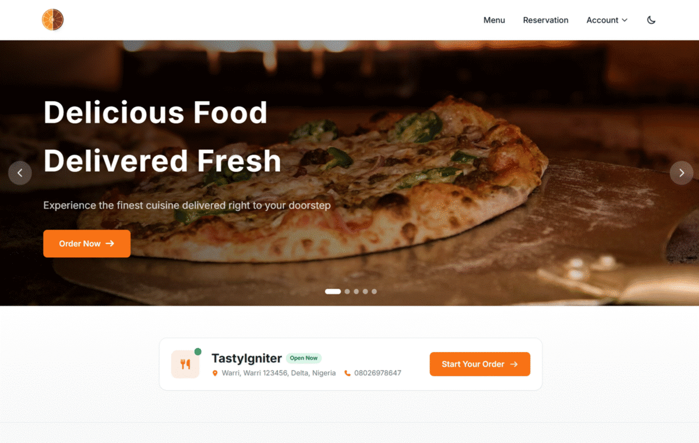

<p align="center">
    <a href="https://github.com/tipowerup/ti-theme-orange-tw/actions/workflows/tests.yml"></a>
    <a href="https://packagist.org/packages/tipowerup/ti-theme-orange-tw"></a>
    <a href="https://packagist.org/packages/tipowerup/ti-theme-orange-tw"></a>
    <a href="https://github.com/tipowerup/ti-theme-orange-tw/stargazers"></a>
    <a href="https://packagist.org/packages/tipowerup/ti-theme-orange-tw"></a>
    <a href="https://packagist.org/packages/tipowerup/ti-theme-orange-tw"></a>
</p>

<p align="center">
    
</p>

## Introduction

Orange TW (also known as **Orange Theme with Tailwind CSS**) is a modernized version of the popular [TastyIgniter Orange Theme](https://github.com/tastyigniter/ti-theme-orange), rebuilt from the ground up with **Tailwind CSS** and enhanced with modern features like dark mode, mobile-first navigation, and SPA-like page transitions. It retains full feature parity with the original Orange theme while delivering a faster, more customizable, and visually refined experience.

Built with Laravel Livewire and Alpine.js, Orange TW is designed for restaurant online ordering on the TastyIgniter platform. It's perfect for restaurants, cafes, bars, bistros, pizza shops, bakeries, food delivery services, or any food-related business looking for a modern, professional storefront.

## What's New in Orange TW

Orange TW takes the solid foundation of the original Orange theme and elevates it with:

- **Tailwind CSS v4** - CSS-first configuration via `@theme`, no `tailwind.config.js`, no PostCSS pipeline; styled through the official `@tailwindcss/vite` plugin
- **TypeScript** - Frontend source migrated to TypeScript under `strict: true`. Modern Alpine components are fully typed via a shared `AlpineComponent<TState, TWire>` helper; legacy jQuery-plugin code is isolated and `@ts-nocheck`-flagged
- **Theme Toolkit** - Shared infrastructure (`@tipowerup/ti-theme-toolkit`) provides the Vite preset, Tailwind v4 theme tokens, and the dark-mode Alpine store; the toolkit ships `.d.ts` declarations so consumers get full intellisense
- **Multi-Banner Hero** - The home-page banner supports multiple slides with autoplay, hover-to-pause, and keyboard navigation; configured directly from the admin panel
- **Dark Mode** - System preference detection with manual toggle, persisted via localStorage; survives `wire:navigate` DOM swaps
- **Mobile App-Like Navigation** - Bottom tab bar navigation for mobile devices (Uber Eats/DoorDash style)
- **Smart Sticky Header** - Hides on scroll down, reveals on scroll up for maximum content visibility
- **SPA-Like Transitions** - Native View Transitions API with Livewire navigate for instant page transitions
- **CSS Variable Theming** - Runtime customizable colors from the admin panel without rebuilding assets; brand colors injected on `<html>` (survives morph), neutral colors scoped to light mode via `:root:not(.dark)`
- **Performance Optimized** - Code splitting, responsive images, debounced inputs, content hashing, and a hashed-bundle JS pipeline that plays nicely with `wire:navigate`

## Features

- **Mobile-first ordering experience** — bottom tab bar, slide-in cart drawer, app-like sheets
- **Dark mode** — system-preference detection with manual toggle; persists across page transitions
- **Runtime brand customization** — change colours, logo, banners, and fonts from the admin without rebuilding assets
- **SPA-like transitions** — instant page swaps via Livewire navigate + the View Transitions API
- **Multi-slide hero banner** — autoplay, hover-to-pause, fully admin-configured
- **Drop-in Orange replacement** — full feature parity with the original Orange theme; works with every TastyIgniter extension

…and many more. See the [documentation](docs/index.md) for the full list.

## Requirements

- TastyIgniter v4.0+
- PHP 8.2+
- Node.js 18+ (for asset compilation)
- TypeScript 5+ (installed automatically as a dev dependency)

## Installation

Install the theme via Composer:

```bash
composer require tipowerup/ti-theme-orange-tw
```

Activate the theme from **Design > Themes** in your TastyIgniter admin panel.
The theme ships with pre-built CSS/JS assets, and the toolkit's auto-publish
hook copies them into your project's `public/vendor/tipowerup-orange-tw/`
on first activation — no manual build step required.

If your favicon or logo doesn't appear after activation (rare, on locked-down
shared hosting where the activation request can't write to `public/`), run
the publish command manually from your project root:

```bash
php artisan igniter:theme-vendor-publish --force
```

## Development

For development with hot reloading:

```bash
npm run dev
```

To build for production:

```bash
npm run build
```

To type-check the TypeScript sources without emitting:

```bash
npm run typecheck
```

After building assets, publish them into the host TastyIgniter project:

```bash
php artisan igniter:theme-vendor-publish --force
```

### Tests

The theme ships a Pest test suite under `tests/`:

```bash
composer test                            # Pint + Pest (Unit + Feature)
vendor/bin/pest --compact                # Pest only
vendor/bin/pest tests/Unit               # Fast unit tests
vendor/bin/pest --filter=FlashMessage    # Filter by name
```

- **Unit tests** — pure logic (FlashMessage normalize, Booking computed, Modal/Slider/Icon helpers, ServiceProvider routes tuple).
- **Feature tests** — boot the package via `tipowerup/testbench`, exercise theme-local Livewire components (`FlashMessage`, `LocalSearch`) and the toolkit-shipped `NewsletterSubscribeForm` registered under the theme's namespace, the Logout controller (with mocked `Cart` / `LogoutCustomer`), error-page templates (Blade compile + icon-name validation), and theme metadata invariants.

### Frontend Source Layout

```
resources/src/
├── css/app.css                       # Tailwind v4 entry — pulls toolkit theme.css
└── js/
    ├── app.ts                        # Entry — registers Alpine factories
    ├── globals.ts                    # Pre-flight: jQuery / flatpickr / intl-tel-input on window
    ├── jquery-plugins.ts             # Legacy jQuery IIFEs (Livewire bridge, country picker, booking) — @ts-nocheck
    ├── global.d.ts                   # Ambient declarations (window, JQuery, etc.)
    ├── types/alpine.ts               # AlpineComponent / AlpineFactory helper types
    └── components/                   # Typed Alpine x-data factories
        ├── index.ts                  # Aggregates + registers all factories
        ├── auto-click.ts
        ├── autocomplete-suggestions.ts
        ├── category-list.ts
        ├── checkout-fulfillment.ts
        ├── cookie-banner.ts
        ├── nav-store.ts              # Active-route store for the mobile bottom tab bar
        ├── quantity-option.ts
        └── slider.ts
```

`resources/js/` holds the ported jQuery-plugin modules (checkout, fulfillment, cart-item, google-maps) — kept in their legacy idiom and marked `@ts-nocheck` so they participate in the bundle without forcing a rewrite.

## Customization

### Theme Colors

All theme colors can be customized from **Design > Themes > Orange TW > Customize**. The theme supports 15 customizable colors including:

- Primary, Secondary, Accent colors
- Success, Warning, Danger, Info states
- Text, Background, Surface, Border colors
- Light and dark mode variants

Colors are applied via CSS variables, so changes take effect immediately without rebuilding assets.

### Dark Mode

Dark mode can be configured to:
- Follow system preference (default)
- Default to light mode
- Default to dark mode

Users can toggle dark mode using the switch in the header, and their preference is saved to localStorage.

### Fonts

Configure Google Fonts from the theme settings. The theme uses Inter as the default font family with optimized font loading.

## Tech Stack

| Technology | Purpose |
|------------|---------|
| Tailwind CSS v4 | CSS-first theming (`@theme`, `@plugin`, `@custom-variant`) |
| TypeScript | Strict-mode frontend source |
| Livewire 3.x | Server-driven dynamic components |
| Alpine.js 3.x | Client-side interactivity |
| Vite 5.x | Asset bundling (via `@tailwindcss/vite`) |
| [`@tipowerup/ti-theme-toolkit`](https://github.com/tipowerup/ti-theme-toolkit) | Shared theme tokens, Vite preset, dark-mode store, auth Livewire components |
| View Transitions API | Page transitions |

## Migration from Orange Theme

Orange TW is designed as a drop-in replacement for the original Orange theme. All TastyIgniter extensions are fully supported. Simply install, activate, and customize your colors.

## Changelog

Please see [CHANGELOG](CHANGELOG.md) for more information on what has changed recently.

## Reporting Issues

If you encounter a bug in this theme, please report it using the [Issue Tracker](https://github.com/tipowerup/ti-theme-orange-tw/issues) on GitHub.

## Contributing

Contributions are welcome! Please read [TastyIgniter's contributing guide](https://tastyigniter.com/docs/resources/contribution-guide).

## Security Vulnerabilities

For reporting security vulnerabilities, please see our security policy.

## Credits

- Based on [TastyIgniter Orange Theme](https://github.com/tastyigniter/ti-theme-orange) by TastyIgniter Dev Team
- Built by [TiPowerUp](https://github.com/tipowerup)

## License

Orange TW Theme is open-source software licensed under the [MIT license](LICENSE.md).
